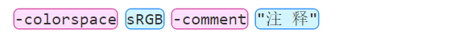
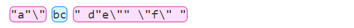
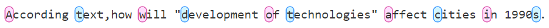

# Regex-collection
## 1.分割命令行
> 首先把命令行字符串根据**不在双引号范围之内**的空格分割，其中**双引号不能被转义（\\"）**，若双引号被转义则当成普通字符

版本v1：
```
\S*?(?<!\\)".*?(?<!\\)"\S*|\S+
```
版本v2：（修复了多个连续的、用双引号引用的字符串会错误按照空格分割的bug）
```
(?:\S*?(?<!\\)".*?(?<!\\)"(?:[^"\s]*(?:\\"))*|\S)+
```
最后版本的预览图：  
  


## 2.提取首字母
> 首先把一句英文按空格分割，然后提取每个子串的第一个字母（不区分大小写）

版本v1：
```
(?<=(?:^|\s)[^A-Z|a-z]{0,})[A-Z|a-z]
```
最后版本的预览图：
  
